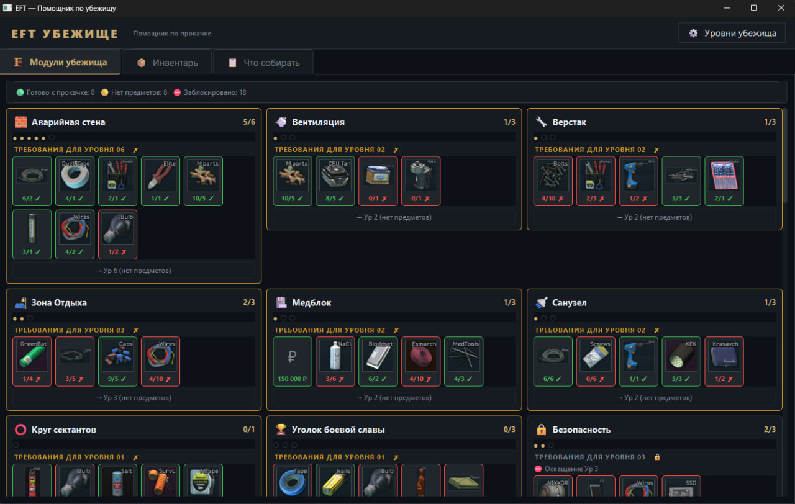

# EFT Hideout Helper

 

Десктопный помощник по прокачке убежища в Escape from Tarkov: показывает, что нужно для следующего уровня каждого модуля, и ведёт учёт собранных предметов.



## Возможности

- **Модули убежища** — требования каждого уровня в виде плиток: иконка предмета, счётчик «есть / нужно» и название во всплывающей подсказке.
- **Инвентарь** — список собранных предметов с поиском и фильтрами по приоритету.
- **Что собирать** — сводка недостающего с разбивкой «нужно сейчас» и «нужно позже».

## Установка

Требуется Python 3.9+ и PyQt6:

```bash
pip install PyQt6
```

## Запуск

```bash
python main.py
```

При первом запуске укажите текущие уровни модулей — изменить их можно в любой момент через **⚙ Уровни убежища**.

## Структура

| Путь | Назначение |
| --- | --- |
| `main.py` | Приложение (PyQt6) |
| `hideout_data.json` | Требования и зависимости модулей |
| `assets/items/` | Иконки предметов (источник — [tarkov.dev](https://tarkov.dev)) |
| `assets/item_images.json` | Соответствие «название → иконка» |

Прогресс пользователя хранится локально в `user_data.json` и в репозиторий не входит.
